# asset
 <a name="namespace_title_asset.asset"></a>


### Diagram
 <a name="namespace_diagram_asset.asset"></a>

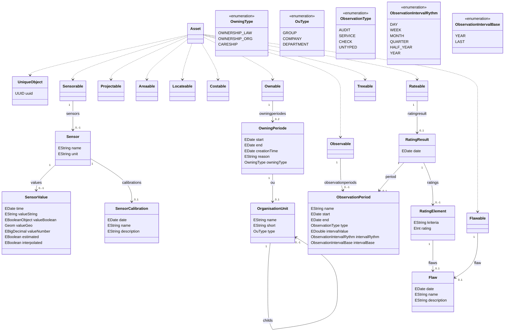


### Classes
 <a name="classes_asset.asset"></a>


#### Asset
 <a name="class_asset.asset"></a>

##### Description
 <a name="class_description_asset.asset"></a>

none

##### Diagram
 <a name="class_diagram_asset.asset"></a>

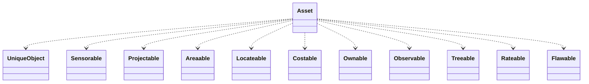

| Name| Type| 
| ----| ----|
| **** | [UniqueObject](#class_asset.uniqueobject) |
| **** | [Sensorable](#class_asset.sensorable) |
| **** | [Projectable](#class_asset.projectable) |
| **** | [Areaable](#class_asset.areaable) |
| **** | [Locateable](#class_asset.locateable) |
| **** | [Costable](#class_asset.costable) |
| **** | [Ownable](#class_asset.ownable) |
| **** | [Observable](#class_asset.observable) |
| **** | [Treeable](#class_asset.treeable) |
| **** | [Rateable](#class_asset.rateable) |
| **** | [Flawable](#class_asset.flawable) |


##### Fields
 <a name="class_fields_asset.asset"></a>

none

##### References
 <a name="class_references_asset.asset"></a>

none

##### Methods
 <a name="class_methods_asset.asset"></a>

none


#### UniqueObject
 <a name="class_asset.uniqueobject"></a>

##### Description
 <a name="class_description_asset.uniqueobject"></a>

none

##### Diagram
 <a name="class_diagram_asset.uniqueobject"></a>

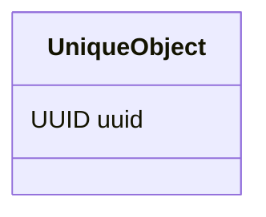

none


##### Fields
 <a name="class_fields_asset.uniqueobject"></a>

| Field| Type| Bounds| Description|
| -----| ----| ------| -----------|
| **uuid** | UUID| 0..1||

##### References
 <a name="class_references_asset.uniqueobject"></a>

none

##### Methods
 <a name="class_methods_asset.uniqueobject"></a>

none


#### Sensorable
 <a name="class_asset.sensorable"></a>

##### Description
 <a name="class_description_asset.sensorable"></a>

none

##### Diagram
 <a name="class_diagram_asset.sensorable"></a>

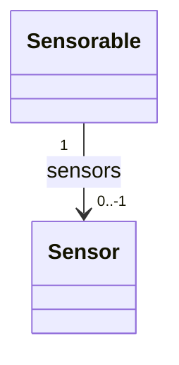

none


##### Fields
 <a name="class_fields_asset.sensorable"></a>

none

##### References
 <a name="class_references_asset.sensorable"></a>

| Name| Type| Bounds| Description|
| ----| ----| ------| -----------|
| **sensors** | [Sensor](#class_asset.sensor)| 0..-1||

##### Methods
 <a name="class_methods_asset.sensorable"></a>

none


#### Projectable
 <a name="class_asset.projectable"></a>

##### Description
 <a name="class_description_asset.projectable"></a>

none

##### Diagram
 <a name="class_diagram_asset.projectable"></a>

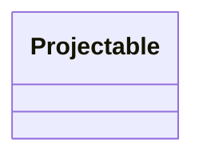

none


##### Fields
 <a name="class_fields_asset.projectable"></a>

none

##### References
 <a name="class_references_asset.projectable"></a>

none

##### Methods
 <a name="class_methods_asset.projectable"></a>

none


#### Areaable
 <a name="class_asset.areaable"></a>

##### Description
 <a name="class_description_asset.areaable"></a>

none

##### Diagram
 <a name="class_diagram_asset.areaable"></a>

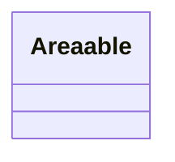

none


##### Fields
 <a name="class_fields_asset.areaable"></a>

none

##### References
 <a name="class_references_asset.areaable"></a>

none

##### Methods
 <a name="class_methods_asset.areaable"></a>

none


#### Locateable
 <a name="class_asset.locateable"></a>

##### Description
 <a name="class_description_asset.locateable"></a>

none

##### Diagram
 <a name="class_diagram_asset.locateable"></a>

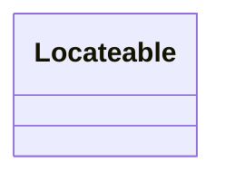

none


##### Fields
 <a name="class_fields_asset.locateable"></a>

none

##### References
 <a name="class_references_asset.locateable"></a>

none

##### Methods
 <a name="class_methods_asset.locateable"></a>

none


#### Costable
 <a name="class_asset.costable"></a>

##### Description
 <a name="class_description_asset.costable"></a>

none

##### Diagram
 <a name="class_diagram_asset.costable"></a>

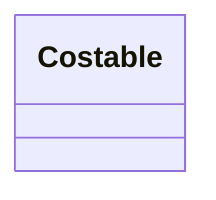

none


##### Fields
 <a name="class_fields_asset.costable"></a>

none

##### References
 <a name="class_references_asset.costable"></a>

none

##### Methods
 <a name="class_methods_asset.costable"></a>

none


#### Ownable
 <a name="class_asset.ownable"></a>

##### Description
 <a name="class_description_asset.ownable"></a>

Gibe Auskunft über alle Informationen im Zusammenhang mit Eigentümerschaft und dem Verantwortungsbereich eines Assets.

##### Diagram
 <a name="class_diagram_asset.ownable"></a>

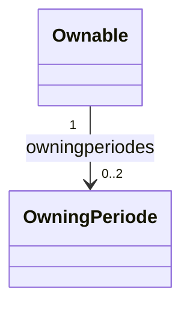

none


##### Fields
 <a name="class_fields_asset.ownable"></a>

none

##### References
 <a name="class_references_asset.ownable"></a>

| Name| Type| Bounds| Description|
| ----| ----| ------| -----------|
| **owningperiodes** | [OwningPeriode](#class_asset.owningperiode)| 0..2||

##### Methods
 <a name="class_methods_asset.ownable"></a>

none


#### Observable
 <a name="class_asset.observable"></a>

##### Description
 <a name="class_description_asset.observable"></a>

none

##### Diagram
 <a name="class_diagram_asset.observable"></a>

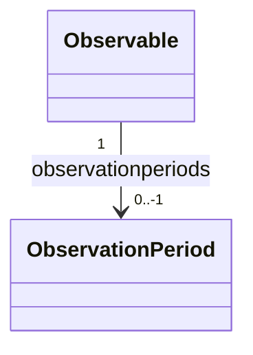

none


##### Fields
 <a name="class_fields_asset.observable"></a>

none

##### References
 <a name="class_references_asset.observable"></a>

| Name| Type| Bounds| Description|
| ----| ----| ------| -----------|
| **observationperiods** | [ObservationPeriod](#class_asset.observationperiod)| 0..-1||

##### Methods
 <a name="class_methods_asset.observable"></a>

none


#### Treeable
 <a name="class_asset.treeable"></a>

##### Description
 <a name="class_description_asset.treeable"></a>

parent for each treetype


##### Diagram
 <a name="class_diagram_asset.treeable"></a>

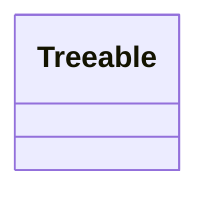

none


##### Fields
 <a name="class_fields_asset.treeable"></a>

none

##### References
 <a name="class_references_asset.treeable"></a>

none

##### Methods
 <a name="class_methods_asset.treeable"></a>

none


#### OwningPeriode
 <a name="class_asset.owningperiode"></a>

##### Description
 <a name="class_description_asset.owningperiode"></a>

none

##### Diagram
 <a name="class_diagram_asset.owningperiode"></a>

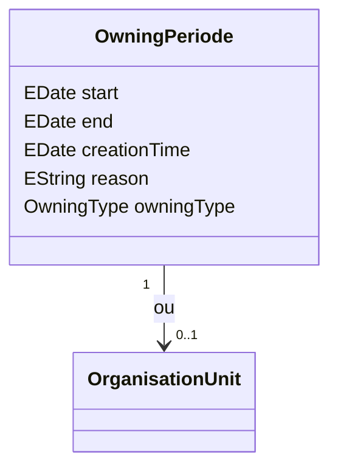

none


##### Fields
 <a name="class_fields_asset.owningperiode"></a>

| Field| Type| Bounds| Description|
| -----| ----| ------| -----------|
| **start** | EDate| 0..1|Start der Eigentümerschaft|
| **end** | EDate| 0..1|Start der Eigentümerschaft|
| **creationTime** | EDate| 0..1|Zeitpunkt der Datensatzerstellung|
| **reason** | EString| 0..1|Grund der Datensatzerstellung|
| **owningType** | OwningType| 0..1||

##### References
 <a name="class_references_asset.owningperiode"></a>

| Name| Type| Bounds| Description|
| ----| ----| ------| -----------|
| **ou** | [OrganisationUnit](#class_asset.organisationunit)| 0..1||

##### Methods
 <a name="class_methods_asset.owningperiode"></a>

none


#### OrganisationUnit
 <a name="class_asset.organisationunit"></a>

##### Description
 <a name="class_description_asset.organisationunit"></a>

SHOULD BE EXTRATED IN AN SEPARATE MODEL
Erganisationseinheit


##### Diagram
 <a name="class_diagram_asset.organisationunit"></a>

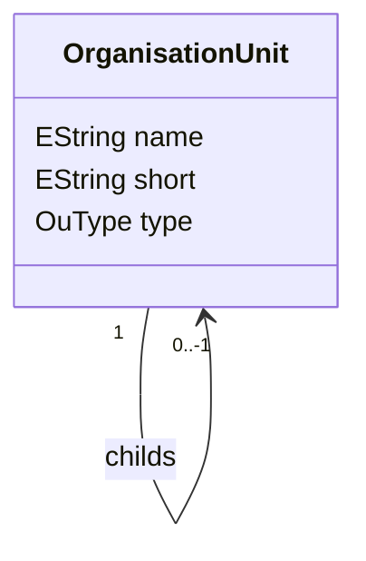

none


##### Fields
 <a name="class_fields_asset.organisationunit"></a>

| Field| Type| Bounds| Description|
| -----| ----| ------| -----------|
| **name** | EString| 0..1||
| **short** | EString| 0..1||
| **type** | OuType| 0..1||

##### References
 <a name="class_references_asset.organisationunit"></a>

| Name| Type| Bounds| Description|
| ----| ----| ------| -----------|
| **parent** | [OrganisationUnit](#class_asset.organisationunit)| 0..1||
| **childs** | [OrganisationUnit](#class_asset.organisationunit)| 0..-1||

##### Methods
 <a name="class_methods_asset.organisationunit"></a>

none


#### Sensor
 <a name="class_asset.sensor"></a>

##### Description
 <a name="class_description_asset.sensor"></a>

Objekt das in der lage ist einen Wert zu einem Zeitpunkt zu messen oder anzuzeigen.
Ist ein Gerät in der lage mehrere Werte zu einem Zeitpunkt zu haben müssen mehrere Sensoren angelegt werden.


TODO: Typisieren andhand des ValueTypes

ggf Überlappung mit Zustand

##### Diagram
 <a name="class_diagram_asset.sensor"></a>

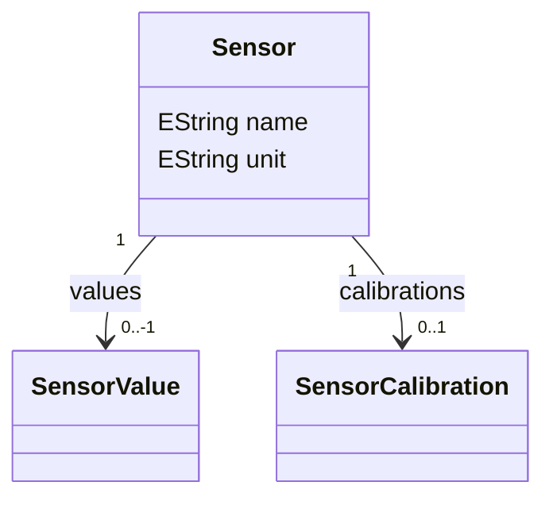

none


##### Fields
 <a name="class_fields_asset.sensor"></a>

| Field| Type| Bounds| Description|
| -----| ----| ------| -----------|
| **name** | EString| 0..1||
| **unit** | EString| 0..1|Die Einheit in der der Messwert gemessen wird.|

##### References
 <a name="class_references_asset.sensor"></a>

| Name| Type| Bounds| Description|
| ----| ----| ------| -----------|
| **values** | [SensorValue](#class_asset.sensorvalue)| 0..-1||
| **calibrations** | [SensorCalibration](#class_asset.sensorcalibration)| 0..1||

##### Methods
 <a name="class_methods_asset.sensor"></a>

none


#### SensorValue
 <a name="class_asset.sensorvalue"></a>

##### Description
 <a name="class_description_asset.sensorvalue"></a>

none

##### Diagram
 <a name="class_diagram_asset.sensorvalue"></a>

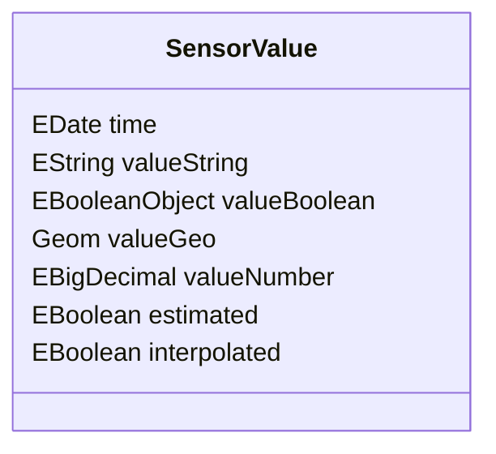

none


##### Fields
 <a name="class_fields_asset.sensorvalue"></a>

| Field| Type| Bounds| Description|
| -----| ----| ------| -----------|
| **time** | EDate| 0..1||
| **valueString** | EString| 0..1||
| **valueBoolean** | EBooleanObject| 0..1||
| **valueGeo** | Geom| 0..1||
| **valueNumber** | EBigDecimal| 0..1||
| **estimated** | EBoolean| 0..1|Wert ist geschätzt|
| **interpolated** | EBoolean| 0..1|Wert ist ergebnis einer interpolation.|

##### References
 <a name="class_references_asset.sensorvalue"></a>

none

##### Methods
 <a name="class_methods_asset.sensorvalue"></a>

none


#### SensorCalibration
 <a name="class_asset.sensorcalibration"></a>

##### Description
 <a name="class_description_asset.sensorcalibration"></a>

none

##### Diagram
 <a name="class_diagram_asset.sensorcalibration"></a>

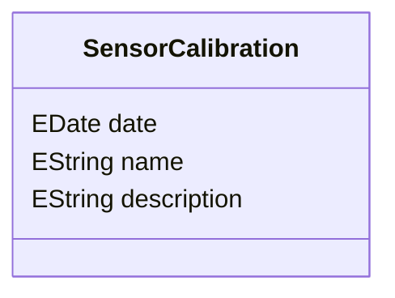

none


##### Fields
 <a name="class_fields_asset.sensorcalibration"></a>

| Field| Type| Bounds| Description|
| -----| ----| ------| -----------|
| **date** | EDate| 1..1||
| **name** | EString| 1..1|Kurze benamung der Kallibirierung die vorgenommen wurde.|
| **description** | EString| 0..1|Ausführliche Beschreibung der Art ung umstände einer Kalibrierung.|

##### References
 <a name="class_references_asset.sensorcalibration"></a>

none

##### Methods
 <a name="class_methods_asset.sensorcalibration"></a>

none


#### ObservationPeriod
 <a name="class_asset.observationperiod"></a>

##### Description
 <a name="class_description_asset.observationperiod"></a>

none

##### Diagram
 <a name="class_diagram_asset.observationperiod"></a>

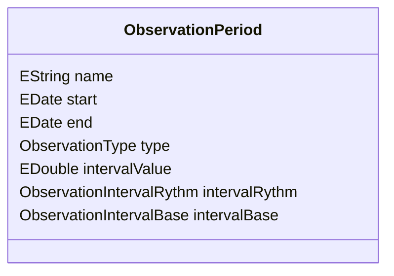

none


##### Fields
 <a name="class_fields_asset.observationperiod"></a>

| Field| Type| Bounds| Description|
| -----| ----| ------| -----------|
| **name** | EString| 0..1||
| **start** | EDate| 0..1||
| **end** | EDate| 0..1||
| **type** | ObservationType| 0..1||
| **intervalValue** | EDouble| 0..1||
| **intervalRythm** | ObservationIntervalRythm| 0..1||
| **intervalBase** | ObservationIntervalBase| 0..1||

##### References
 <a name="class_references_asset.observationperiod"></a>

none

##### Methods
 <a name="class_methods_asset.observationperiod"></a>

none


#### RatingResult
 <a name="class_asset.ratingresult"></a>

##### Description
 <a name="class_description_asset.ratingresult"></a>

Resultat einer Überprüfung eines  Assets.

##### Diagram
 <a name="class_diagram_asset.ratingresult"></a>

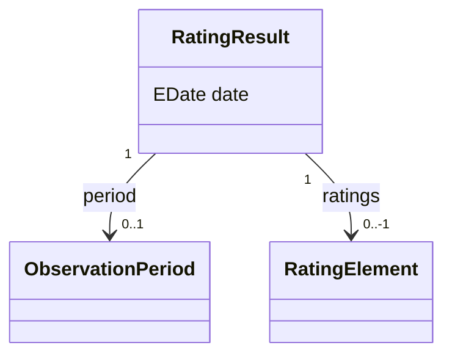

none


##### Fields
 <a name="class_fields_asset.ratingresult"></a>

| Field| Type| Bounds| Description|
| -----| ----| ------| -----------|
| **date** | EDate| 1..1|Datum der überprü|

##### References
 <a name="class_references_asset.ratingresult"></a>

| Name| Type| Bounds| Description|
| ----| ----| ------| -----------|
| **period** | [ObservationPeriod](#class_asset.observationperiod)| 0..1||
| **ratings** | [RatingElement](#class_asset.ratingelement)| 0..-1||

##### Methods
 <a name="class_methods_asset.ratingresult"></a>

none


#### RatingElement
 <a name="class_asset.ratingelement"></a>

##### Description
 <a name="class_description_asset.ratingelement"></a>

Bewertung die bei einer Kontrolle des

##### Diagram
 <a name="class_diagram_asset.ratingelement"></a>

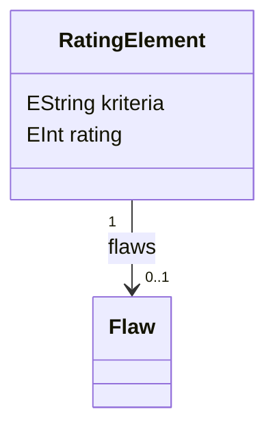

none


##### Fields
 <a name="class_fields_asset.ratingelement"></a>

| Field| Type| Bounds| Description|
| -----| ----| ------| -----------|
| **kriteria** | EString| 0..1||
| **rating** | EInt| 0..1||

##### References
 <a name="class_references_asset.ratingelement"></a>

| Name| Type| Bounds| Description|
| ----| ----| ------| -----------|
| **flaws** | [Flaw](#class_asset.flaw)| 0..1||

##### Methods
 <a name="class_methods_asset.ratingelement"></a>

none


#### Rateable
 <a name="class_asset.rateable"></a>

##### Description
 <a name="class_description_asset.rateable"></a>

none

##### Diagram
 <a name="class_diagram_asset.rateable"></a>

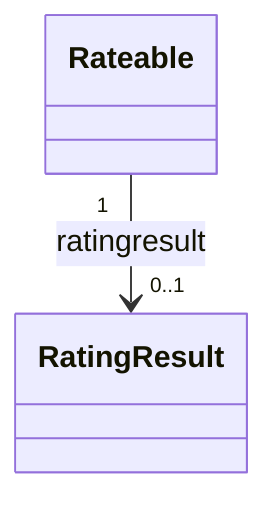

none


##### Fields
 <a name="class_fields_asset.rateable"></a>

none

##### References
 <a name="class_references_asset.rateable"></a>

| Name| Type| Bounds| Description|
| ----| ----| ------| -----------|
| **ratingresult** | [RatingResult](#class_asset.ratingresult)| 0..1||

##### Methods
 <a name="class_methods_asset.rateable"></a>

none


#### Flaw
 <a name="class_asset.flaw"></a>

##### Description
 <a name="class_description_asset.flaw"></a>

none

##### Diagram
 <a name="class_diagram_asset.flaw"></a>

```mermaid
classDiagram
 class Flaw{
 EDate date
 EString name
 EString description
 }


```

none


##### Fields
 <a name="class_fields_asset.flaw"></a>

| Field| Type| Bounds| Description|
| -----| ----| ------| -----------|
| **date** | EDate| 0..1||
| **name** | EString| 0..1||
| **description** | EString| 0..1||

##### References
 <a name="class_references_asset.flaw"></a>

none

##### Methods
 <a name="class_methods_asset.flaw"></a>

none


#### Flawable
 <a name="class_asset.flawable"></a>

##### Description
 <a name="class_description_asset.flawable"></a>

none

##### Diagram
 <a name="class_diagram_asset.flawable"></a>

```mermaid
classDiagram
 class Flawable{
 }

 Flawable "1" --> "0..1" Flaw : flaw


```

none


##### Fields
 <a name="class_fields_asset.flawable"></a>

none

##### References
 <a name="class_references_asset.flawable"></a>

| Name| Type| Bounds| Description|
| ----| ----| ------| -----------|
| **flaw** | [Flaw](#class_asset.flaw)| 0..1||

##### Methods
 <a name="class_methods_asset.flawable"></a>

none


### Enumerations
 <a name="enums_asset.asset"></a>


#### OwningType
 <a name="enum_asset.owningtype"></a>

##### Description
 <a name="enum_description_asset.owningtype"></a>

Eigentum Juristisch

##### Literals
 <a name="enum_literals_asset.owningtype"></a>

| Literal| Description|
| -------| ----------|
| **OWNERSHIP_LAW**| |
| **OWNERSHIP_ORG**| |
| **CARESHIP**| Bestand|


#### OuType
 <a name="enum_asset.outype"></a>


##### Literals
 <a name="enum_literals_asset.outype"></a>

| Literal| Description|
| -------| ----------|
| **GROUP**| |
| **COMPANY**| |
| **DEPARTMENT**| |


#### ObservationType
 <a name="enum_asset.observationtype"></a>

##### Description
 <a name="enum_description_asset.observationtype"></a>

Typen einer ObservationPeriode

##### Literals
 <a name="enum_literals_asset.observationtype"></a>

| Literal| Description|
| -------| ----------|
| **AUDIT**| Entspricht einer Technischen Abnahmeprüfung durch einer "zuständige Überwachungsstelle" (ZÜS)
Zum beispiel TÜV|
| **SERVICE**| Gesetzlich oder durch technische Vorgaben notwendige Wartung durch intere oder Externe Mitarbeiter.|
| **CHECK**| Freiwillige Überprüfung  durch intere oder Externe Mitarbeiter.|
| **UNTYPED**| Untypisierte bewertung ggf.
 durch Bürger|


#### ObservationIntervalRythm
 <a name="enum_asset.observationintervalrythm"></a>

##### Description
 <a name="enum_description_asset.observationintervalrythm"></a>

Rhytmen ür die Berechnung einer neuen ObservationPeriode

##### Literals
 <a name="enum_literals_asset.observationintervalrythm"></a>

| Literal| Description|
| -------| ----------|
| **DAY**| |
| **WEEK**| |
| **MONTH**| |
| **QUARTER**| |
| **HALF_YEAR**| |
| **YEAR**| |


#### ObservationIntervalBase
 <a name="enum_asset.observationintervalbase"></a>

##### Description
 <a name="enum_description_asset.observationintervalbase"></a>

BasisTypen für die Berechnung einer neuen ObservationPeriode

##### Literals
 <a name="enum_literals_asset.observationintervalbase"></a>

| Literal| Description|
| -------| ----------|
| **YEAR**| |
| **LAST**| |


