# bsm
 

### Diagram
 

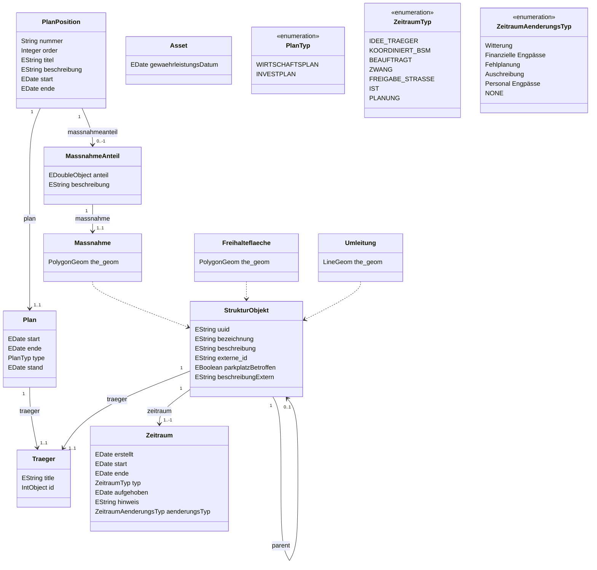

### Classes
 

#### Plan
 

##### Description
 

Ein Plan einer Trägers, in dem für einen vorgegebenen Zeitraum Wirtschaftliche tätigkeitsfelder aufgelistet werden.
Beispiel, Wirtschaftplan, Mittelfrist-Finanzplan.

##### Diagram
 

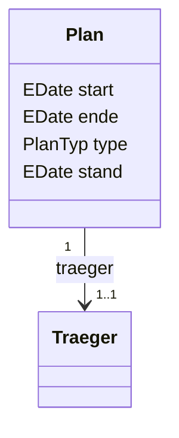

none

##### Fields
 

| Field| Type| Bounds| Description|
| -----| ----| ------| -----------|
| **start** | EDate| 1..1|Beginn des Zeitraums für den der Plan gilt.|
| **ende** | EDate| 1..1|Ende des Zeitraums für den der Plan gilt.|
| **type** | PlanTyp| 0..1|Typisierung des Wirtschaftsplanes.|
| **stand** | EDate| 0..1|Zeitpunkt zu dem der Plan gültig ist.|

##### References
 

| Name| Type| Bounds| Description|
| ----| ----| ------| -----------|
| **traeger** | [Traeger](#class_bsm.traeger)| 1..1|Der Träger, der den Plan erstellt.|

##### Methods
 

none

#### PlanPosition
 

##### Description
 

Eine Zeile in einem Plan.

##### Diagram
 

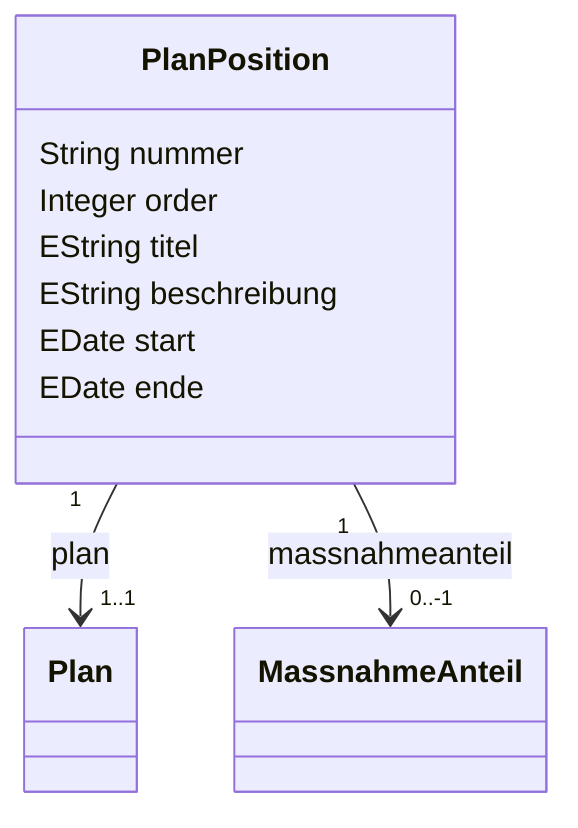

none

##### Fields
 

| Field| Type| Bounds| Description|
| -----| ----| ------| -----------|
| **nummer** | String| 0..1|Die Nummer zur ermögliches eines schnellen Erfasses einer Position in einer Liste mehrerer Positionen.|
| **order** | Integer| 0..1|Sortiert die Positionen im Plan.|
| **titel** | EString| 0..1|Die Kurzbezeichnung der Position.|
| **beschreibung** | EString| 0..1|Eine erklärende Beschreibung der der Position.|
| **start** | EDate| 0..1|Start der Position, wenn leer wird ist das Startdatum des Plans gemeint.|
| **ende** | EDate| 0..1|Start der Position, wenn leer wird ist das Enddatum des Plans gemeint.|

##### References
 

| Name| Type| Bounds| Description|
| ----| ----| ------| -----------|
| **plan** | [Plan](#class_bsm.plan)| 1..1|Verweis auf den Plan der die Planpositionen Gruppiert.|
| **massnahmeanteil** | [MassnahmeAnteil](#class_bsm.massnahmeanteil)| 0..-1||

##### Methods
 

none

#### MassnahmeAnteil
 

##### Description
 

Der Anteil mit dem eine Massnahme in einer Planposition enthalten ist.

##### Diagram
 

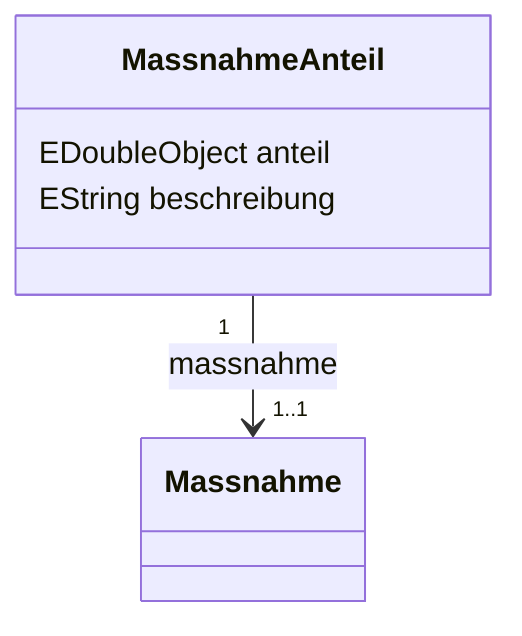

none

##### Fields
 

| Field| Type| Bounds| Description|
| -----| ----| ------| -----------|
| **anteil** | EDoubleObject| 0..1|Der Anteil in Prozent.|
| **beschreibung** | EString| 0..1|Textliche beschreibung des Anteils.|

##### References
 

| Name| Type| Bounds| Description|
| ----| ----| ------| -----------|
| **massnahme** | [Massnahme](#class_bsm.massnahme)| 1..1|Die Massnehme dem der Anteil zugeordnet ist.|

##### Methods
 

none

#### StrukturObjekt
 

##### Description
 

Eine räumlich und zeitlich abgrenzbare Aktion eines Trägers.

##### Diagram
 

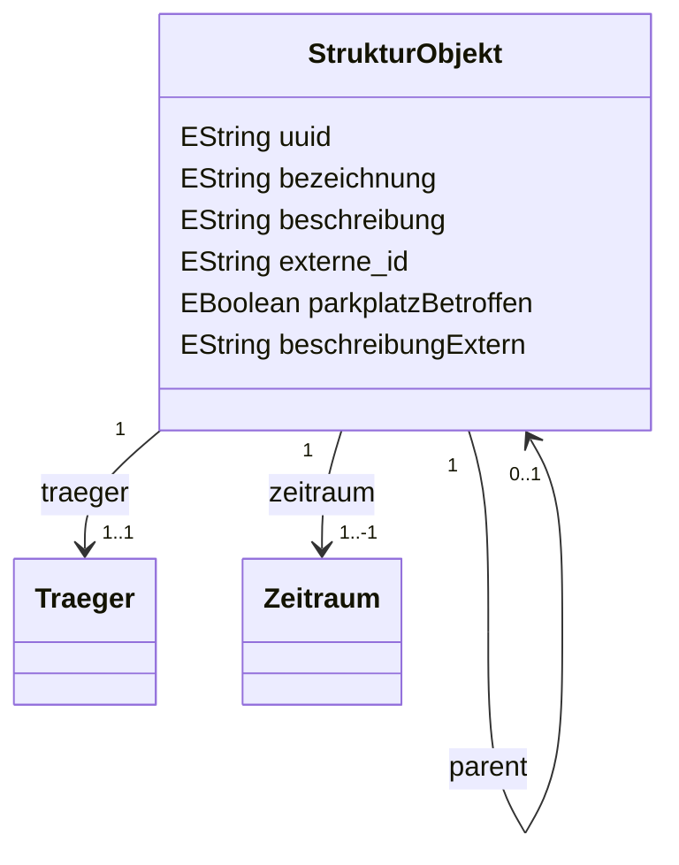

none

##### Fields
 

| Field| Type| Bounds| Description|
| -----| ----| ------| -----------|
| **uuid** | EString| 0..1|Eindeutlige und unveränderliche ID der Massnahnme.|
| **bezeichnung** | EString| 0..1|Kurzer schnell verständlicher Name der Massnahme, der in der Regel auf jedem offiziellen Dokument verwendet wird.
Für Straßenbaumaßnahmen idealerweise im Muster Straßenname: Art d. Maßnahme.|
| **beschreibung** | EString| 0..1|Text, der hilft, intern die Masnahme näher zu erklären. Länge des textes sollte 500 zeichen nicht überschreiten.|
| **externe_id** | EString| 0..1|Id im Quellsystem dieses Datensatzes.|
| **parkplatzBetroffen** | EBoolean| 0..1|Gibt an, ob die Baumassnahme zu Einschänkungen an Parkplätzen führt.|
| **beschreibungExtern** | EString| 0..1|Text, der hilft, der öffentlichkeit die Masnahme näher zu erklären. Länge des textes sollte 500 zeichen nicht überschreiten.|

##### References
 

| Name| Type| Bounds| Description|
| ----| ----| ------| -----------|
| **parent** | [StrukturObjekt](#class_bsm.strukturobjekt)| 0..1|Verweis auf die übergeordnete Massnahme.|
| **traeger** | [Traeger](#class_bsm.traeger)| 1..1||
| **zeitraum** | [Zeitraum](#class_bsm.zeitraum)| 1..-1|Verweis aus die Massnahme des Zeitraums|

##### Methods
 

none

#### Traeger
 

##### Description
 

none

##### Diagram
 

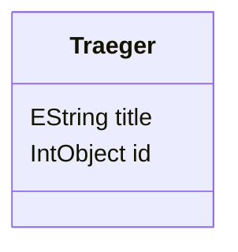

none

##### Fields
 

| Field| Type| Bounds| Description|
| -----| ----| ------| -----------|
| **title** | EString| 0..1|Eine kurze übersichtliuche Bezeichnung des Trägers.|
| **id** | IntObject| 0..1|ID des Trägers, wird durch Stadt vergeben|

##### References
 

none

##### Methods
 

none

#### Zeitraum
 

##### Description
 

Historisierter Zeitraum einer Massnahme. Genauigkeit von 'start' und 'ende' ist abhängig von dem Horizint der Umsetzung
- >4 Jahre mindestens jährlich
- 2-4 Jahre mindestens halbjährlich
- <2 Jahre monatsscharf

Gültig ist,
- je Typ, immer der Zeitraum mit dem spätesten 'erstellt' , der keine 'aufgehoben' hat.
- typübergreifend, wie 'je Typ'  und dann in folgender Rangordnung der Zeitraumtypen: 
> ZWANG
> IDEE_TRAEGER
> KOORDINIERT_BSM
> BEAUFTRAGT
> FREIGABE_STRASSE
> PLANUNG
> IST

##### Diagram
 

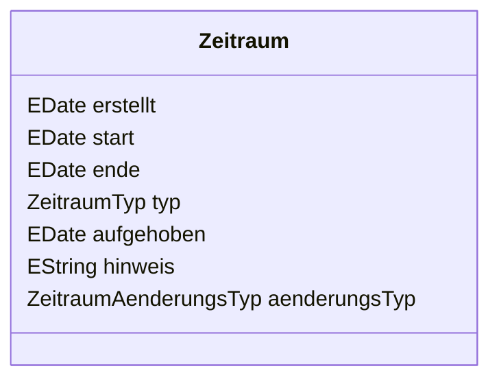

none

##### Fields
 

| Field| Type| Bounds| Description|
| -----| ----| ------| -----------|
| **erstellt** | EDate| 1..1||
| **start** | EDate| 1..1|Markiert den in der Realität stattfindenden ZeitraumStart.|
| **ende** | EDate| 0..1|Markiert den in der Realität stattfindenden ZeitraumEnde.
Nur im IST ist das Ende Optional|
| **typ** | ZeitraumTyp| 1..1|Markiert die art des Zeitraumes|
| **aufgehoben** | EDate| 0..1|Datum, an dem dieser Zeitraum als als aufgehoben markiert wird.|
| **hinweis** | EString| 0..1|Hinweis darauf, wieso ein neuer Zeitabschnitt erstellt wird.|
| **aenderungsTyp** | ZeitraumAenderungsTyp| 0..1|Typisiete Begründung für die Änderung des vorhergehenden Zeitraum.|

##### References
 

none

##### Methods
 

none

#### Massnahme
 

##### Description
 

Baumassnahme eines Trägers.

##### Diagram
 

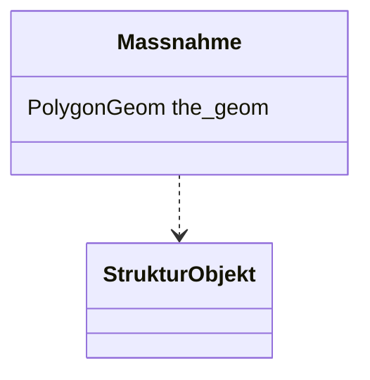

| Name| Type| 
| ----| ----|
| **** | [StrukturObjekt](#class_bsm.strukturobjekt) |

##### Fields
 

| Field| Type| Bounds| Description|
| -----| ----| ------| -----------|
| **the_geom** | PolygonGeom| 0..1|Das Polygon|

##### References
 

none

##### Methods
 

none

#### Freihalteflaeche
 

##### Description
 

Bereiche, die freigehalten werden sollen. Sollten Massnahmen auf einer Freihaltefläche stattfinden, muss derr Massnahmeträger und das Baustellenmanagement darüber informiert werden und einen Ausnahmegrund formulieren.

##### Diagram
 

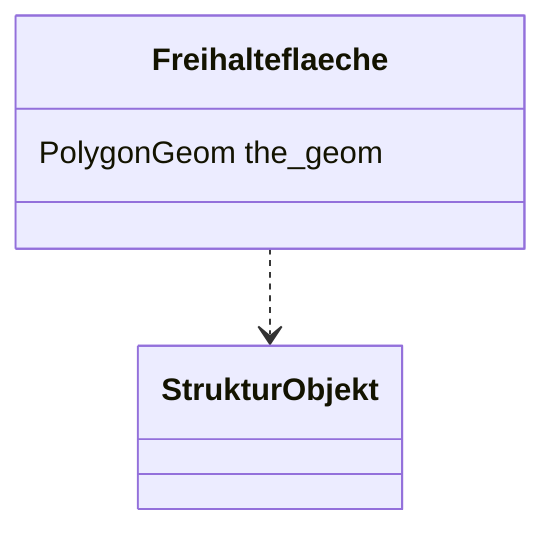

| Name| Type| 
| ----| ----|
| **** | [StrukturObjekt](#class_bsm.strukturobjekt) |

##### Fields
 

| Field| Type| Bounds| Description|
| -----| ----| ------| -----------|
| **the_geom** | PolygonGeom| 0..1|Das Polygon|

##### References
 

none

##### Methods
 

none

#### Umleitung
 

##### Description
 

Bescheiben Wege, die als Umleitung für massnahmen dienen. Umleitungen die sich oberschneiden sollen dem zuständigen angezeigt werden.

##### Diagram
 

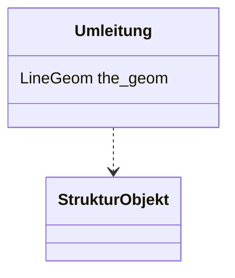

| Name| Type| 
| ----| ----|
| **** | [StrukturObjekt](#class_bsm.strukturobjekt) |

##### Fields
 

| Field| Type| Bounds| Description|
| -----| ----| ------| -----------|
| **the_geom** | LineGeom| 0..1|Die Linie|

##### References
 

none

##### Methods
 

none

#### Asset
 

##### Description
 

Ein Gegenstand im Stadtraum.
- Wird unter führung von Frau Dietsch im SmartCityProjekt zusammen mit KIJ und Stadt separat und Detailierter Modeliert.
Betrifft:
- Straßen
- Gebäude
- Haltestellen
- Mülleiner
- technische Anlagen
- ....

und deren Metadaten, Zustände und Prüfintervalle!

##### Diagram
 

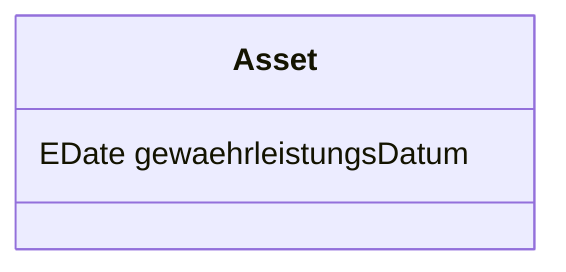

none

##### Fields
 

| Field| Type| Bounds| Description|
| -----| ----| ------| -----------|
| **gewaehrleistungsDatum** | EDate| 0..1||

##### References
 

none

##### Methods
 

none

### Enumerations
 

#### PlanTyp
 

##### Description
 

Typisiert die Art des Plans

##### Literals
 

| Literal| Description|
| -------| ----------|
| **WIRTSCHAFTSPLAN**| Wirtschaftsplan Fokus Folgejahr|
| **INVESTPLAN**| Fokus mittelfristige Investitionen|

#### ZeitraumTyp
 

##### Description
 

Liste an Markern, die verwendet werden muss um Zeiträume zu klassifizieren.

##### Literals
 

| Literal| Description|
| -------| ----------|
| **IDEE_TRAEGER**| Markiert den Zeitraum, den sich der Täger initial und unamgestimmt Vorschlägt. Idee des Trägers|
| **KOORDINIERT_BSM**| Markiert den Zeitraum, der nach Abstimmung innerhalb des Baustellenmanagements festgelegt wurde.|
| **BEAUFTRAGT**| Markiert den Zeitraum, in dem das Unternehmen mit der Umsetzung beauftragt ist.|
| **ZWANG**| Markiert einen Zeitraum in dem die Massnahme zwingend erledigt erden muss. Kann gleichzeitig zum VORSSCHLAG_TRAEGER erstellt werden.|
| **FREIGABE_STRASSE**| Der Zeitraum für die die Baustelle eine Freigabe der Straßen/Verkehrsbehörde hat.|
| **IST**| Tatsächlicher Zeitpunkt der realen Ausführung.|
| **PLANUNG**| Markiert den jeweils genausten Zeitraum vor IST|

#### ZeitraumAenderungsTyp
 

##### Description
 

Typisiete Begründung für die Änderung des  eines Zeitraums
.

##### Literals
 

| Literal| Description|
| -------| ----------|
| **Witterung**| |
| **Finanzielle Engpässe**| |
| **Fehlplanung**| |
| **Auschreibung**| |
| **Personal Engpässe**| |
| **NONE**| |

